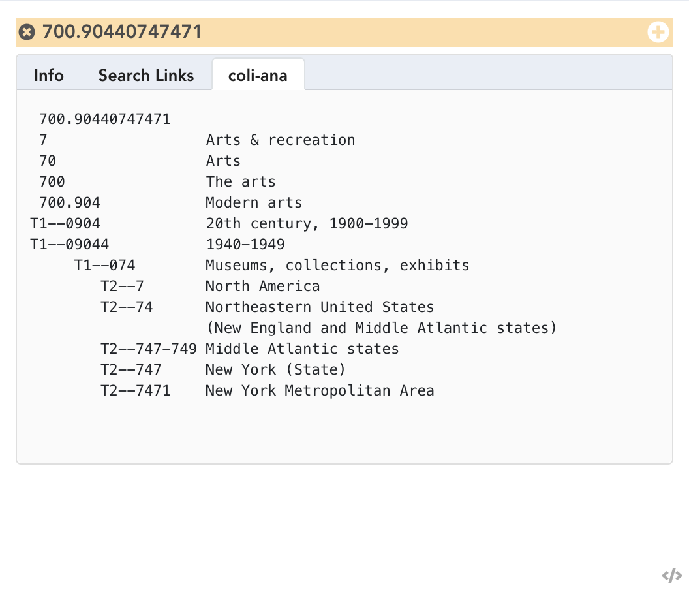
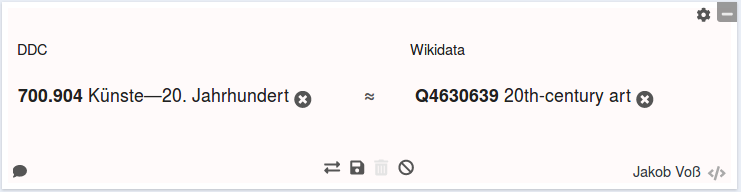

# Introducing coli-conc

## Colibri, the mother of all

**Co**ntext generation and **li**nguistic tools for **b**ibliographic **r**etrieval **i**nterfaces,
conducted by our colleauge Ulrike Reiner since 2002

* automatic DDC classification (**coli-auto**)
* automatic analysis and synthesis of DDC numbers (**coli-ana**)
* automatic checking of DDC number correctness (**coli-corr**)
* semi-automatic creation of DDC concordance (**coli-conc**)

$\Longrightarrow$ Domain expert and previous works to build on

## coli-ana, an example

{height=80%}

## coli-conc, an example

{height=35%}

## coli-conc, the idea

* avoid aching hands with a mapping-tool

* facilitate creation and management of concordances\
  between knowledge organization systems

## coli-conc, the project (2014)

* 2014
    * Create first prototype
    * Create specification
    * Write project grant

* 2016: Start new from scratch in Java
    * failed
    * learned

* 2018: start new from scratch in Node & Vue

## Data processing

CSV, MARCXML, SKOS ... $\longrightarrow$ Cleanup

CSV, MARCXML, SKOS $\longrightarrow$ JSKOS

* 3 different tools: jskos-convert, mc2skos, skos2jskos

## Infrastructure

* cocoda
* jskos-server
* ...

## user interface

* live demo!

# Lessons learned

## People stick to spreadsheets

* tyranny of the ~~file~~ spreadsheet
    
    * 1-to-n mappings?
    * repeatable fields (e.g. creator names)?
    * leading zeroes
    * ...

* at least better than MS Word

* you think CSV, they think Excel

* other popular spreadsheet tools: Google Sheets, OpenRefine

## Software development is communication

* listen

    * what is actually wanted?
    * how do the involved parties work?

* understand

    * face2face meetings to find a common language
    * most problems are communication problems

* explain

    * pros and cons of technical decisions
    * why open by default is better

<!--
examples: 

* insist on CC0 license
* explain URIs
* we pushed back user groups and review workflows 
-->

## No schema, no data quality

* Notations and identifiers must match regular expressions

* JSON Schema helped to find inconsistencies in JSON data

* Additional constraints not expressible in JSON Schema

* empty strings, empty arrays, null values...

*Never trust any data unless you have validated its shapes!*

## Holy decoupling!

* SOA

* modules

* shell scripts

...

Easy to replace parts of the infrastructure. Example RVK hosting:

* RVK API
* own database
* DANTE
* jskos-server

## Don't hesitate to throw away code 

* Being forced to throw away code can help

* One script has been written in PHP, Perl and JavaScript
  (helps to treat scripts as black-box modules)

* many scripts and modules, sometimes it's easier to reimplement a piece anyway
  
* But: each time we stared from scratch we had more specifications and modules to build on

## Look out for beneficial beta-users

* real use-cases and outcome instead of click-around testing

* users prefer a mature product instead buggy prototype

* their use-cases drive development in different directions

*Agile development requires agile users!*

## Patience and luck

* Colibri started in 2002

* coli-conc started in 2013

* Current development cycle started in 2018

# Summary

## Feedback is welcome!

<https://coli-conc.gbv.de/> the project

<https://coli-conc.gbv.de/cocoda/> the mapping-tool

<https://github.com/gbv/cocoda/> the source code

<https://gbv.github.io/cocoda/> the documentation

<https://github.com/gbv/cocoda/issues> the issue tracker

