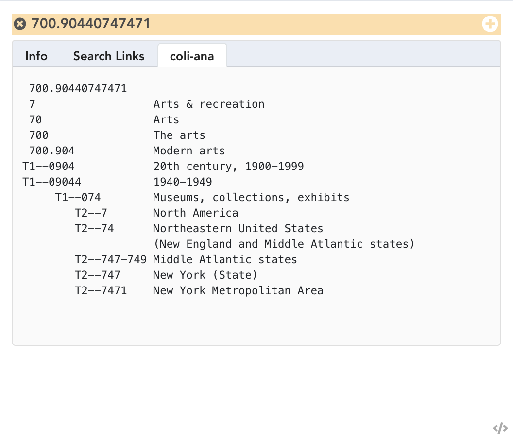
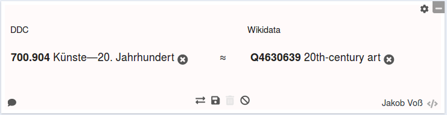
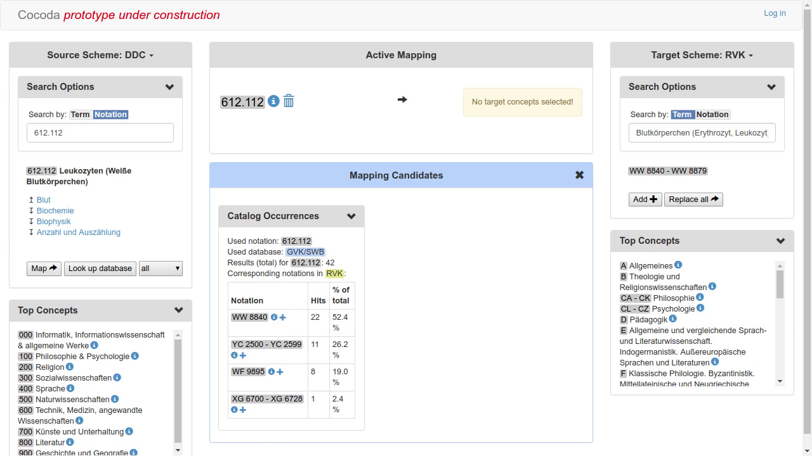
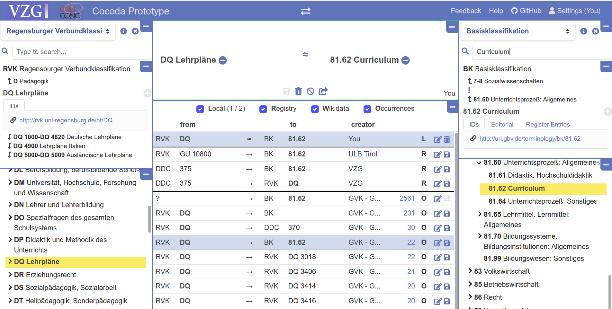
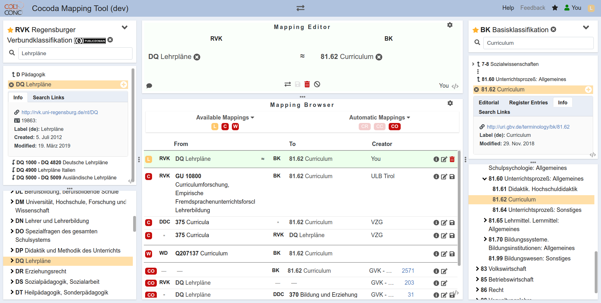

# Introducing coli-conc

## Colibri, the mother of all

**Co**ntext generation and **li**nguistic tools for **b**ibliographic **r**etrieval **i**nterfaces,
conducted by our colleauge Ulrike Reiner since 2002

* automatic DDC classification (**coli-auto**)
* automatic checking of DDC number correctness (**coli-corr**)
* automatic analysis and synthesis of DDC numbers (**coli-ana**)
* semi-automatic creation of DDC concordance (**coli-conc**)

$\Rightarrow$ Domain expert and previous works to build on

## coli-ana, an example

{height=70mm width=81mm}

## coli-conc, an example

{width=110mm height=29mm}

## coli-conc, the idea

* a **mapping-tool** to avoid aching hands

* facilitate creation and management of **concordances**\
  between **knowledge organization systems (KOS)**

. . .

* in particular library classifications

    * Dewey Decimal Classification (DDC)
    * Regensburger Verbundklassifikation (RVK)
    * Basisklassifikation (BK)
    * *several local classification schemes* 
    * ...

## coli-conc, to-do list

1. Collect KOS metadata\
   $\Rightarrow$ [BARTOC](https://bartoc.org/) registry

. . .

2. Collect and publish existing mappings

    * DDC/RVK/GND/BK/STW/LCSH/IxTheo\
      384.491 mappings

    * Wikidata\
      3.607.683 mappings (as of 6/2018)

    * additional mappings not converted yet

. . .

3. Create mapping tool\
   $\Rightarrow$ Cocoda!

## Cocoda 2014: first prototype with AngularJS

{width=128m height=72mm}

## Cocoda 2015-2016

* Write project grant and receive additional funding

* Continue with specification (esp. JSKOS data format)

* Create a new implementation

## JSKOS data format for Knowledge Organization Systems

* JSON-LD for SKOS (`prefLabel`, `broader`, `narrower`...)

* Additional properties from other ontologies\
  (`url`, `next`, `previous`, `startDate`, `endDate`...)

* Additional classes for mappings, concordances, registries...

$\Rightarrow$ <https://gbv.github.io/jskos/>

## Getting data into JSKOS format

1. CSV, MARCXML, SKOS, ... $\longrightarrow$ Cleanup

2. CSV, MARCXML, SKOS $\longrightarrow$ JSKOS

Using at least three different tools:

* skos2jskos (Perl)
* jskos-convert (NodeJS)
* mc2skos (Python)
* scripts for minor JSON adjustments (jq)

## Cocoda 2015-2016

* Write project grant and receive additional funding

* Continue with specification (especially JSKOS data format)

* Create a new implementation

## Cocoda 2015-2016

* Write project grant and receive additional funding

* Continue with specification (especially JSKOS data format)

* Create a new implementation

    * as monolithical Java application

    . . .

    * and throw it away afterwards

## coli-conc 2018: start new from scratch (Node & Vue)

{width=114mm height=58mm}

## coli-conc 2019: curent layout

{width=114mm height=58mm}

## Live Demo

<https://coli-conc.gbv.de/cocoda/app/>

## Infrastructure

* jskos-server & DANTE terminology registry (JSKOS-API)

* mapping suggestions (OpenRefine Reconciliation API)

* login-server (OAuth)

# Lessons learned

## People stick to spreadsheets

* limited
    
    * 1-to-n mappings
    * repeatable fields
    * leading zeroes
    * ...

* at least better than MS Word

* you think CSV, they think Excel

. . .

***$\Rightarrow$ spreadsheets are not perfect but actually useful***

## Software development is communication

* listen

    * what is actually wanted?
    * how do the involved parties work?

* understand

    * face2face meetings to find a common language
    * most problems are communication problems

* explain

    * pros and cons of technical decisions
    * basic such as URIs and Open Data
    * not all features are implemented first

. . .

***$\Rightarrow$ Communicate!***

## No schema, no data quality

* Notations and identifiers must match regular expressions

* JSON Schema helped to find inconsistencies in JSON data

* Additional constraints not expressible in JSON Schema

* empty strings, empty arrays, null values...

. . .

***$\Rightarrow$ Never trust any data you haven't validated!***

## Holy decoupling

* service oriented architecture (SOA)

* APIs and data formats matter most

* Things will break anyway

. . .

Easy to replace parts of the infrastructure

* RVK API $\rightarrow$ own DB $\rightarrow$ DANTE $\rightarrow$ jskos-server

* PHP $\rightarrow$ Perl $\rightarrow$ JavaScript

. . .

***$\Rightarrow$ split your application into decoupled services!***

## Look out for beneficial beta-users

* users prefer a mature product instead buggy prototype

* real use-cases and outcome instead of click-around testing

* use-cases will drive development in different directions

. . .

***$\Rightarrow$ Agile development requires some agile users!***

## Patience and luck

* Colibri started in 2002

* coli-conc started in 2013

* Current development cycle started in 2018

. . .

***$\Rightarrow$ Good luck!***
 
# Summary

## We build...

* JSKOS data format to unifiy KOS & concordances data

* several web services to process and share mapping data

* a web application based on the format and services 

## We learned to...

* stop worrying about spreadsheets

* listen, understand, and explain

* inist on schemas for data quality

* decouple and rewrite services

* work together with beta-user

* be more patient and use lucky chances

## Feedback is welcome!

<https://coli-conc.gbv.de/> the project

<https://coli-conc.gbv.de/cocoda/> the mapping-tool

<https://github.com/gbv/cocoda/> the source code

<https://gbv.github.io/cocoda/> the documentation

<https://github.com/gbv/cocoda/issues> the issue tracker

